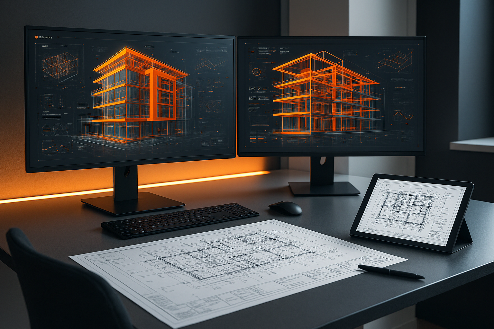
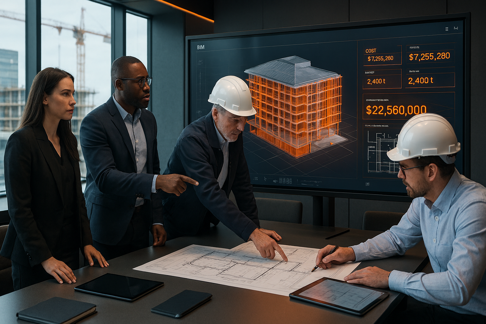

::: {.hero-section}

  <video autoplay muted loop playsinline poster="../images/header-background.jpg">
    <source src="../images/hero-video.mp4" type="video/mp4">
  </video>

::: {.container}
::: {.hero-title}
 

### Eksperci w Kosztorysowaniu i Przedmiarach

# Usługi BIM Takeoff
:::

::: {.hero-subtitle}
Ponad 2000 projektów zrealizowanych w zakresie zabudowy wewnętrznej, robót konstrukcyjnych, ochrony przeciwpożarowej i fasad. Od szczegółowych przedmiarów po kompletne pakiety przetargowe - dostarczamy na całym świecie.
:::

::: {style="margin-top: 32px; display: flex; gap: 16px; justify-content: center; flex-wrap: wrap;"}
[ZAPRASZAMY DO KONTAKTU](kontakt.qmd){.cta-primary}
[POZNAJ USŁUGI](#nasze-usługi){.cta-secondary}
:::
:::
:::

::: {.container}

## O Nas

::: {style="display: grid; grid-template-columns: repeat(auto-fit, minmax(300px, 1fr)); gap: 24px; margin: 32px 0;"}

::: {style="display: flex; align-items: center; background: white; padding: 20px; border-left: 4px solid var(--bim-orange); box-shadow: 0 2px 8px rgba(0,0,0,0.1);"}
<i class="bi bi-award" style="font-size: 48px; color: var(--bim-orange); margin-right: 20px; flex-shrink: 0;"></i>

::: {style="flex: 1;"}
**Eksperci w Kosztorysowaniu z Międzynarodowym Doświadczeniem**

20 lat doświadczenia | 2000+ Projektów | Wielka Brytania, Australia i Europa
:::
:::

::: {style="display: flex; align-items: center; background: white; padding: 20px; border-left: 4px solid var(--bim-orange); box-shadow: 0 2px 8px rgba(0,0,0,0.1);"}
<i class="bi bi-tools" style="font-size: 48px; color: var(--bim-orange); margin-right: 20px; flex-shrink: 0;"></i>

::: {style="flex: 1;"}
**Specjalistyczna Wiedza Branżowa**

Systemy Suchej Zabudowy | Ochrona Przeciwpożarowa | Fasady | Roboty Konstrukcyjne
:::
:::

::: {style="display: flex; align-items: center; background: white; padding: 20px; border-left: 4px solid var(--bim-orange); box-shadow: 0 2px 8px rgba(0,0,0,0.1);"}
<i class="bi bi-shield-check" style="font-size: 48px; color: var(--bim-orange); margin-right: 20px; flex-shrink: 0;"></i>

::: {style="flex: 1;"}
**Zgodność z Polskimi Standardami**

Zgodność z ISO 19650  | 2000+ Projektów UK/EU/AU | Gotowość BIM 2030
:::
:::

:::

## Kosztorysowanie BIM 5D – Międzynarodowe Standardy, Lokalna Wiedza

Łączymy międzynarodowe doświadczenie z pełną znajomością polskiego rynku budowlanego. Specjalizujemy się w pakietach wysokiej wartości i złożoności - systemy suchej zabudowy, struktury, ochrona przeciwpożarowa i elewacje.

Dzięki ponad 2000 zrealizowanym projektom w Wielkiej Brytanii, Australii i Europie, zapewniamy precyzję potrzebną do wygrywania rentownych zleceń. Stosujemy międzynarodowe standardy przy pełnej zgodności z polskimi wymogami.

Oferujemy kosztorysy zgodne z wymogami BIM 2030, wspierając inwestorów i generalnych wykonawców w przygotowaniu do nowych przepisów.

::: {.image-section style="margin: 48px 0; text-align: center;"}
{style="max-width: 900px; height: auto; border-radius: 8px; box-shadow: 0 4px 16px rgba(0,0,0,0.15); display: block; margin-left: auto; margin-right: auto;"}
:::

::: {.stats-section}
::: {.stat}
::: {.stat-number}
2000+
:::
::: {.stat-label}
Zrealizowanych Projektów
:::
:::

::: {.stat}
::: {.stat-number}
12M+
:::
::: {.stat-label}
m² Wycenionych
:::
:::

::: {.stat}
::: {.stat-number}
20+
:::
::: {.stat-label}
Lat Doświadczenia
:::
:::

::: {.stat}
::: {.stat-number}
90%
:::
::: {.stat-label}
Redukcja Czasu Kosztorysowania
:::
:::
:::

## Dlaczego Warto z Nami Współpracować?

::: {.feature-grid}
::: {.feature-card}
### <i class="bi bi-bullseye" style="color: var(--bim-orange); margin-right: 12px;"></i>Międzynarodowe Doświadczenie, Lokalna Specyfika

**20 Lat na Rynkach UK, EU i Australii + Znajomość Polskich Standardów**

Dwie dekady praktycznego doświadczenia w kosztorysowaniu na wymagających rynkach międzynarodowych. Nasza ekspertyza obejmuje zabudowę wewnętrzną, struktury, ochronę przeciwpożarową i fasady. Łączymy międzynarodowe standardy z pełną zgodnością z polskimi wymaganiami, zapewniając wiarygodne dane do podejmowania decyzji.
:::

::: {.feature-card}
### <i class="bi bi-lightning-charge" style="color: var(--bim-orange); margin-right: 12px;"></i>Oszczędność Czasu – 90% Szybciej

**3 Dni Zamiast 3 Tygodni**

Technologia BIM 5D pozwala skrócić czas kosztorysowania o 90% w porównaniu z tradycyjnymi metodami. Wyodrębniamy dane z modeli BIM (Revit, ArchiCAD, Tekla, IFC), dostarczając wyniki gotowe do Państwa oprogramowania kosztorysowego. Typowy czas realizacji: 3-5 dni, zachowując dokładność ±5%.
:::

::: {.feature-card}
### <i class="bi bi-piggy-bank" style="color: var(--bim-orange); margin-right: 12px;"></i>Optymalizacja Wartości Inwestycji

**Analiza Value Engineering**

Precyzyjne kosztorysowanie zapobiega przekroczeniom budżetu i marnowaniu materiałów. Nasza analiza i opcje optymalizacji identyfikują oszczędności bez poświęcania jakości czy zgodności z normami lub wymaganiami. Pomagamy wyceniać realnie i unikać niespodzianek podczas realizacji.
:::

::: {.feature-card}
### <i class="bi bi-clipboard-check" style="color: var(--bim-orange); margin-right: 12px;"></i>Dokumentacja Zgodna ze Standardami

**Raporty Gotowe do Audytu i Kontroli**

Otrzymują Państwo szczegółowe zestawienia ilości, materiałów i kosztów sformatowane zgodnie z Państwa wymaganiami. Nasze raporty są przejrzyste, śledzone i gotowe do integracji z Państwa systemem. Każdy przedmiar zawiera kontrolę jakości  i walidację.
:::

::: {.feature-card}
### <i class="bi bi-person-badge" style="color: var(--bim-orange); margin-right: 12px;"></i>Specjalizacja w Złożonych Pakietach

**Prawdziwa Ekspertyza Branżowa**

Nasz zespół wnosi praktyczną wiedzę w złożonych pakietach budowlanych. Specjalizujemy się w systemach suchej zabudowy, ochronie przeciwpożarowej, elewacjach oraz robotach konstrukcyjnych. Międzynarodowe doświadczenie w połączeniu z nowoczesną technologią BIM i znajomością polskich przepisów.
:::

::: {.feature-card}
### <i class="bi bi-shield-check" style="color: var(--bim-orange); margin-right: 12px;"></i>Przygotowanie na BIM 2030

**Zgodność z Nowymi Wymogami**

Wspieramy przygotowanie do wymogów BIM 2030. Specjalizujemy się w systemach bezpieczeństwa pożarowego, renowacji elewacji i wymaganiami dotyczącymi bezpieczeństwa. Precyzyjne planowanie pomaga unikać niespodzianek podczas realizacji inwestycji.
:::
:::

## Nasze Usługi

::: {.feature-grid}
::: {.feature-card}
### <i class="bi bi-calculator" style="color: var(--bim-orange); margin-right: 12px;"></i>Kosztorysowanie i Planowanie Budżetu
Precyzyjne wyceny zgodne z KNR/KNNR, które pomagają wygrywać przetargi. Od wstępnych kosztorysów po szczegółowe pakiety przetargowe z analizą optymalizacji wartości i oceną ryzyka.

[Dowiedz się więcej →](uslugi/kosztorysowanie-i-planowanie-budzetu.qmd)
:::

::: {.feature-card}
### <i class="bi bi-bricks" style="color: var(--bim-orange); margin-right: 12px;"></i>Specjalistyczne Usługi Branżowe
Doświadczenie w systemach suchej zabudowy,  ochrony przeciwpożarowej - pasywnej i aktywnej, elewacjach oraz robotach konstrukcyjnych. Ponad 20 lat praktycznego doświaczenia w wycenie skomplikowanych projektów.

[Dowiedz się więcej →](uslugi/specjalistyczne-branzy-budowlane.qmd)
:::

::: {.feature-card}
### <i class="bi bi-lightning-charge-fill" style="color: var(--bim-orange); margin-right: 12px;"></i>Automatyczny Przedmiar z Modeli BIM
Przetwarzanie modeli IFC z Revit, ArchiCAD i Tekla. **90% szybciej** niż tradycyjne przedmiary 2D z aktualizacjami w czasie rzeczywistym przy zmianach projektowych. Dokładność ±5%.

[Dowiedz się więcej →](uslugi/automatyczny-przedmiar-obmiar.qmd)
:::

::: {.feature-card}
### <i class="bi bi-stopwatch" style="color: var(--bim-orange); margin-right: 12px;"></i>Bieżąca Kontrola Kosztów
Regularne raporty kosztowe dla inwestycji 4-6 miesięcznych. System wczesnego ostrzegania przed przekroczeniami budżetu z rekomendacjami optymalizacji wartości.

[Dowiedz się więcej →](uslugi/szybka-kontrola-kosztow.qmd)
:::

::: {.feature-card}
### <i class="bi bi-tree" style="color: var(--bim-orange); margin-right: 12px;"></i>Kosztorysowanie BREEAM/ESG
Kosztorysowanie śladu węglowego zintegrowane ze śledzeniem materiałów zrównoważonych i weryfikacją zgodności certyfikacyjnej. Wsparcie w osiąganiu celów środowiskowych.

[Dowiedz się więcej →](uslugi/kosztorysowanie-breeam-esg.qmd)
:::

::: {.feature-card}
### <i class="bi bi-tools" style="color: var(--bim-orange); margin-right: 12px;"></i>Kosztorysowanie Instalacji MEP
Specjalistyczne kosztorysowanie dla obiektów logistycznych, chłodni, systemów HVAC, instalacji elektrycznych i ochrony przeciwpożarowej.

[Dowiedz się więcej →](uslugi/precyzyjne-kosztorysowanie-mep.qmd)
:::

::: {.feature-card}
### <i class="bi bi-diagram-3" style="color: var(--bim-orange); margin-right: 12px;"></i>Analiza Wariantowa
Porównanie alternatywnych rozwiązań projektowych, materiałów i metod budowy. Podejmowanie świadomych decyzji w oparciu o dokładne dane kosztowe.

[Dowiedz się więcej →](uslugi/analiza-wieloscenariuszowa.qmd)
:::

::: {.feature-card}
### <i class="bi bi-clipboard-data" style="color: var(--bim-orange); margin-right: 12px;"></i>Kompleksowe Raportowanie
Szczegółowe zestawienia kosztów, wizualne dashboardy i raporty gotowe do eksportu, zintegrowane z Państwa procesem pracy.

[Dowiedz się więcej →](uslugi/kompleksowe-raportowanie.qmd)
:::

::: {.feature-card}
### <i class="bi bi-file-earmark-text" style="color: var(--bim-orange); margin-right: 12px;"></i>Przygotowanie Ofert Przetargowych
Profesjonalna dokumentacja przetargowa i wsparcie w zarządzaniu procesem składania ofert. Kompleksowa koordynacja od strategii cenowej po finalne złożenie oferty.

[Dowiedz się więcej →](uslugi/pisanie-ofert-i-zarzadzanie-przetargami.qmd)
:::

::: {.feature-card}
### <i class="bi bi-rulers" style="color: var(--bim-orange); margin-right: 12px;"></i>Tradycyjny Przedmiar z Rysunków 2D
Precyzyjny przedmiar z rysunków 2D i specyfikacji. Szczegółowy pomiar i kwantyfikacja gdy modele BIM nie są dostępne, zachowując dokładność dla tradycyjnej realizacji projektów.

[Dowiedz się więcej →](uslugi/tradycyjny-przedmiar-ilosci.qmd)
:::

::: {.feature-card}
### <i class="bi bi-database" style="color: var(--bim-orange); margin-right: 12px;"></i>Zarządzanie Danymi BIM
Centralna koordynacja danych projektowych i strukturyzacja informacji BIM. Zarządzanie przepływem informacji, zapewnianie jakości danych przez cały cykl życia projektu.

[Dowiedz się więcej →](uslugi/zarzadzanie-danymi-budowlanymi.qmd)
:::

::: {.feature-card}
### <i class="bi bi-truck" style="color: var(--bim-orange); margin-right: 12px;"></i>Logistyka Budowlana
Planowanie logistyki placu budowy, harmonogramowanie dostaw materiałów i koordynacja łańcucha dostaw. Optymalizacja przepływów pracy i efektywna alokacja zasobów.

[Dowiedz się więcej →](uslugi/logistyka-budowlana.qmd)
:::
:::

::: {.image-section style="margin: 64px 0; text-align: center;"}
{style="max-width: 1000px; height: auto; border-radius: 8px; box-shadow: 0 4px 16px rgba(0,0,0,0.15); display: block; margin-left: auto; margin-right: auto;"}
:::

::: {style="margin: 64px 0; padding: 48px 32px; background: linear-gradient(135deg, var(--bim-charcoal) 0%, #3a3a3a 100%); border-radius: 8px; text-align: center;"}
::: {style="max-width: 800px; margin: 0 auto;"}
<h2 style="color: var(--bim-white); border-bottom: 3px solid var(--bim-orange);">Nowoczesne Kosztorysowanie BIM 5D</h2>

Technologia BIM 5D zapewnia precyzję i szybkość potrzebną w nowoczesnym budownictwie. Nasze usługi pomagają wygrywać rentowne zlecenia przy jednoczesnym zmniejszeniu ryzyka przekroczeń budżetu.

::: {style="display: grid; grid-template-columns: repeat(auto-fit, minmax(200px, 1fr)); gap: 24px; margin-top: 32px;"}
::: {style="padding: 16px;"}
<h3 style="color: var(--bim-orange); font-size: 36px; margin-bottom: 8px;">90%</h3>

Redukcja czasu kosztorysowania

:::

::: {style="padding: 16px;"}
<h3 style="color: var(--bim-orange); font-size: 36px; margin-bottom: 8px;">±5%</h3>

Dokładność wyceny

:::

::: {style="padding: 16px;"}
<h3 style="color: var(--bim-orange); font-size: 36px; margin-bottom: 8px;">24h</h3>

Aktualizacje przy zmianach

:::
:::
:::
:::

## Ekspertyza Branżowa

Rozumiemy specyfikę różnych sektorów budownictwa:

::: {.feature-grid}
::: {.feature-card}
### <i class="bi bi-building" style="color: var(--bim-orange); margin-right: 12px;"></i>Magazyny i Logistyka
**Doświadczenie:** Centra dystrybucyjne, chłodnie, obiekty fulfillment
**Specjalizacja:** Realizacja fast-track, obiekty cross-dockingowe, instalacje chłodnicze

::: {style="margin-top: 16px;"}
[Poznaj Rozwiązania →](branze/magazyny-logistyka.qmd){.cta-primary}
:::
:::

::: {.feature-card}
### <i class="bi bi-hdd-rack" style="color: var(--bim-orange); margin-right: 12px;"></i>Centra Danych
**Doświadczenie:** Obiekty Tier III/IV
**Specjalizacja:** Krytyczne systemy MEP, redundancja zasilania, infrastruktura chłodzenia

::: {style="margin-top: 16px;"}
[Poznaj Rozwiązania →](branze/centra-danych.qmd){.cta-primary}
:::
:::

::: {.feature-card}
### <i class="bi bi-houses" style="color: var(--bim-orange); margin-right: 12px;"></i>Deweloperstwo Mieszkaniowe
**Doświadczenie:** Budownictwo wielorodzinne, projekty mieszane
**Specjalizacja:** Kosztorysowanie na poziomie lokali, prefabrykacja, efektywność energetyczna

::: {style="margin-top: 16px;"}
[Poznaj Rozwiązania →](branze/deweloperstwo-mieszkaniowe.qmd){.cta-primary}
:::
:::

::: {.feature-card}
### <i class="bi bi-cone-striped" style="color: var(--bim-orange); margin-right: 12px;"></i>Remediacja i Modernizacja
**Doświadczenie:** Zgodność z przepisami bezpieczeństwa, modernizacje elewacji
**Specjalizacja:** Systemy bezpieczeństwa pożarowego, remediacja okładzin, wymogi BIM 2030

::: {style="margin-top: 16px;"}
[Poznaj Rozwiązania →](branze/remediacja.qmd){.cta-primary}
:::
:::

::: {.feature-card}
### <i class="bi bi-buildings" style="color: var(--bim-orange); margin-right: 12px;"></i>Deweloperstwo Komercyjne
**Doświadczenie:** Biurowce, centra handlowe, kompleksy mieszane
**Specjalizacja:** Aranżacje najemców, realizacja etapowa, optymalizacja wartości

::: {style="margin-top: 16px;"}
[Poznaj Rozwiązania →](branze/deweloperstwo-komercyjne.qmd){.cta-primary}
:::
:::

::: {.feature-card}
### <i class="bi bi-home-heart" style="color: var(--bim-orange); margin-right: 12px;"></i>Spółdzielnie Mieszkaniowe
**Doświadczenie:** Termomodernizacje, programy remontowe
**Specjalizacja:** Wsparcie w dotacjach, optymalizacja wartości, zgodność z wymogami energetycznymi

::: {style="margin-top: 16px;"}
[Poznaj Rozwiązania →](branze/spoldzielnie-mieszkaniowe.qmd){.cta-primary}
:::
:::

::: {.feature-card}
### <i class="bi bi-hospital" style="color: var(--bim-orange); margin-right: 12px;"></i>Opieka Zdrowotna
**Doświadczenie:** Szpitale, centra medyczne, obiekty specjalistyczne
**Specjalizacja:** Kompartmentacja przeciwpożarowa, systemy gazów medycznych, redundancja zasilania

::: {style="margin-top: 16px;"}
[Poznaj Rozwiązania →](branze/obiekty-medyczne.qmd){.cta-primary}
:::
:::

::: {.feature-card}
### <i class="bi bi-gear-wide-connected" style="color: var(--bim-orange); margin-right: 12px;"></i>Przemysł i Produkcja
**Doświadczenie:** Zakłady produkcyjne, hale montażowe
**Specjalizacja:** Konstrukcje ciężkie, systemy dźwigowe, przemysłowe instalacje MEP

::: {style="margin-top: 16px;"}
[Poznaj Rozwiązania →](branze/przemysl-i-produkcja.qmd){.cta-primary}
:::
:::

::: {.feature-card}
### <i class="bi bi-sign-merge-left" style="color: var(--bim-orange); margin-right: 12px;"></i>Infrastruktura
**Doświadczenie:** Mosty, tunele, infrastruktura transportowa
**Specjalizacja:** Konstrukcje sprężane, fundamenty głębokie, systemy inżynieryjne

::: {style="margin-top: 16px;"}
[Poznaj Rozwiązania →](branze/infrastruktura-i-roboty-inzynieryjne.qmd){.cta-primary}
:::
:::
:::
:::

:::

::: {.trust-section}
::: {.container}
## Dlaczego Międzynarodowi Deweloperzy Nam Ufają

::: {.trust-badges}
::: {.trust-badge}
#### <i class="bi bi-patch-check" style="color: var(--bim-orange); margin-right: 8px;"></i>Wieloletnie Doświadczenie
Międzynarodowe Standardy QS
:::

::: {.trust-badge}
#### <i class="bi bi-patch-check" style="color: var(--bim-orange); margin-right: 8px;"></i>ISO 19650
BIM Poziom 2 Compliance
:::

::: {.trust-badge}
#### <i class="bi bi-patch-check" style="color: var(--bim-orange); margin-right: 8px;"></i>20 Lat Doświadczenia
UK, EU, Australia
:::
:::
:::
:::

::: {.image-section style="margin: 64px 0; text-align: center;"}
{style="max-width: 1000px; height: auto; border-radius: 8px; box-shadow: 0 4px 16px rgba(0,0,0,0.15); display: block; margin-left: auto; margin-right: auto;"}
:::

::: {.container}

## Nasz Proces: Od Modelu BIM do Kosztorysu w 3-5 Dni

::: {.process-steps}
::: {.process-step}
#### 1. Przesłanie Modelu + Kick-off
Przekazanie modelu BIM. Spotkanie inicjujące w celu zrozumienia wymagań projektu, zakresu i specyfikacji.
:::

::: {.process-step}
#### 2. Automatyczny Przedmiar + Weryfikacja
Oprogramowanie ekstrahuje ilości automatycznie. Zespół ekspertów sprawdza i waliduje wszystkie pomiary dla zapewnienia dokładności.
:::

::: {.process-step}
#### 3. Analiza Kosztów
Stosujemy aktualne stawki rynkowe, lokalne bazy cenowe (KNR/KNNR) i specyfikacje projektowe do stworzenia szczegółowego zestawienia kosztów.
:::

::: {.process-step}
#### 4. Dostarczenie Raportu
Kompleksowe zestawienie kosztów z wizualnymi dashboardami, porównaniami wariantów i formatami gotowymi do eksportu.
:::

::: {.process-step}
#### 5. Prezentacja + Pytania
Wspólne omówienie raportu, odpowiedzi na pytania i dyskusja o możliwościach optymalizacji wartości.
:::
:::

::: {.callout-box}
#### <i class="bi bi-bullseye" style="color: var(--bim-orange); margin-right: 12px;"></i>Projekt Pilotażowy
**Oferta Wprowadzająca:** Pierwszy projekt z 50% rabatem. Przekonają się Państwo o precyzji i szybkości BIM 5D bez długoterminowych zobowiązań.

[Zaplanuj Projekt Pilotażowy →](kontakt.qmd){.cta-primary}
:::

::: {style="margin: 64px 0; padding: 0; background: var(--bim-light-gray); border-radius: 8px; overflow: hidden;"}
::: {style="display: grid; grid-template-columns: 1fr 1fr; gap: 0;"}
::: {style="padding: 48px; display: flex; flex-direction: column; justify-content: center;"}
<h3 style="color: var(--bim-charcoal); margin-top: 0; margin-bottom: 16px;">Zapraszamy do Współpracy</h3>

Przekonają się Państwo o precyzji i szybkości nowoczesnego kosztorysowania BIM. Od szczegółowych przedmiarów po kompletne pakiety przetargowe – dostarczamy dokładność potrzebną do wygrywania rentownych zleceń.

Co otrzymają Państwo:

<ul style="color: var(--bim-charcoal); margin-bottom: 24px;">
<li>Szczegółowe przedmiary ilościowe</li>
<li>Profesjonalne kosztorysy zgodne z KNR/KNNR</li>
<li>Analiza optymalizacji wartości</li>
<li>Raporty gotowe do audytu</li>
</ul>

::: {style="margin-top: 24px;"}
[Zapraszamy do Kontaktu →](kontakt.qmd){.cta-primary}
:::
:::

::: {style="background: var(--bim-charcoal); padding: 48px; display: flex; flex-direction: column; justify-content: center;"}

Zaufali nam deweloperzy i wykonawcy z:

::: {style="margin-top: 24px; line-height: 2;"}

🇬🇧 Wielkiej Brytanii

🇦🇺 Australii

🇪🇺 Unii Europejskiej

:::

::: {style="margin-top: 32px; padding-top: 32px; border-top: 1px solid var(--bim-medium-gray);"}

2000+ zrealizowanych projektów

12M+ m² wycenionych

20+ lat doświadczenia

:::
:::
:::
:::

## Najczęściej Zadawane Pytania

::: {.faq-section}
::: {.faq-item}
::: {.faq-question}
**P: Czy znają Państwo polskie standardy i normy kosztorysowe?**
:::
::: {.faq-answer}
O: Oczywiście. Łączymy międzynarodowe standardy z pełną zgodnością z polskimi wymaganiami. Nasze kosztorysy są przygotowane zgodnie z polskimi wymogami, wykorzystując zarówno międzynarodowe doświadczenie, jak i lokalną wiedzę rynkową.
:::
:::

::: {.faq-item}
::: {.faq-question}
**P: Jak szybko mogą Państwo zaktualizować kosztorys przy zmianach projektowych?**
:::
::: {.faq-answer}
O: Technologia BIM 5D pozwala na aktualizacje w czasie rzeczywistym. Gdy następują zmiany w modelu BIM, możemy zaktualizować kosztorys w ciągu 24 godzin, zachowując pełną dokładność wyceny.
:::
:::

::: {.faq-item}
::: {.faq-question}
**P: Czy oferują Państwo bieżącą kontrolę kosztów podczas realizacji?**
:::
::: {.faq-answer}
O: Tak. Zapewniamy regularne raporty kosztowe (tygodniowe lub miesięczne), porównując rzeczywiste koszty z planowanymi. System wczesnego ostrzegania pozwala przewidzieć przekroczenia budżetu zanim staną się problemem.
:::
:::

::: {.faq-item}
::: {.faq-question}
**P: Jakie formaty plików BIM obsługują Państwo?**
:::
::: {.faq-answer}
O: Pracujemy z formatem IFC (Industry Foundation Classes) z Revit, ArchiCAD i Tekla. Obsługujemy również tradycyjne rysunki 2D i specyfikacje, gdy modele BIM nie są dostępne.
:::
:::

::: {.faq-item}
::: {.faq-question}
**P: Czy są Państwo przygotowani na wymogi BIM 2030?**
:::
::: {.faq-answer}
O: Tak. Nasze procesy są zgodne z nadchodzącymi wymogami BIM 2030. Wspieramy klientów w przygotowaniu do nowych przepisów, szczególnie w obszarze bezpieczeństwa pożarowego i elewacji.
:::
:::

::: {.faq-item}
::: {.faq-question}
**P: Czym różnią się Państwo od lokalnych firm kosztorysowych?**
:::
::: {.faq-answer}
O: Przynosimy 20 lat międzynarodowego doświadczenia z rynków, gdzie BIM 5D jest standardem. Łączymy zaawansowaną technologię BIM z pełną znajomością polskich standardów KNR/KNNR. Oferujemy 90% redukcję czasu kosztorysowania przy dokładności ±5%.
:::
:::
:::

## Zapraszamy do Współpracy

::: {.callout-box .text-center}
### Dołączą Państwo do 2000+ Projektów, Które Zaufały Naszej Ekspertyzie

Zapraszamy na bezpłatną 30-minutową konsultację lub do rozpoczęcia od projektu pilotażowego z 50% rabatem

[Umów Konsultację](kontakt.qmd){.cta-primary}
[Sprawdź Potencjalne Oszczędności](zasoby/kalkulator-roi.qmd){.cta-secondary}

**Kontakt:** [info@bimtakeoff.com](mailto:info@bimtakeoff.com) | [+48 508 209 313](tel:+48508209313)
:::

:::
