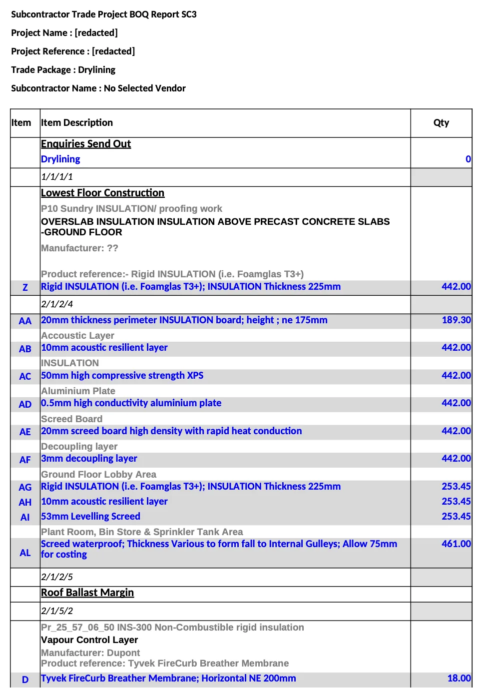
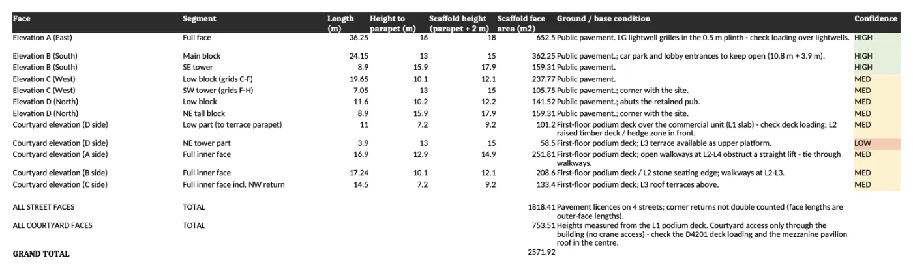

::: {.hero-section}

  <video autoplay muted loop playsinline poster="../images/header-background.jpg" preload="none">
    <source data-src="../images/hero-video.webm" type="video/webm">
    <source data-src="../images/hero-video.mp4" type="video/mp4">
  </video>

::: {.container}
::: {.hero-title}
 

::: {.hero-eyebrow}
Kosztorysowanie dla wykonawców · Polska · Wielka Brytania · Australia
:::

# Przedmiary robót i kosztorysy ofertowe dla wykonawców
:::

::: {.hero-subtitle}
Prześlij dokumentację przetargową. Otrzymasz przedmiar robót lub kosztorys ofertowy w formacie, którego wymaga zamawiający, gotowy do złożenia przed terminem.
:::

::: {.hero-actions}
[Prześlij dokumentację](kontakt.qmd){.cta-primary}
[Bezpłatny przedmiar próbny](kontakt.qmd#probny){.cta-secondary}
:::
:::
:::

::: {.proof-band}
::: {.container}
::: {.proof-band-head}
::: {.proof-band-headline}
20 lat przedmiarów i kosztorysów w Polsce, Wielkiej Brytanii i Australii.
:::

::: {.proof-band-sub}
Przedmiary według KNR/KNNR, NRM2, SMM7 lub AS 4000, zależnie od tego, w jakiej podstawie napisany jest kosztorys.
:::
:::

::: {.proof-cards}
::: {.proof-card}
::: {.proof-card-label}
Generalny wykonawca · pełny przedmiar
:::
::: {.proof-card-title}
Budynek mieszkalny, Londyn
:::
::: {.proof-card-text}
Kompletny przedmiar do oferty generalnego wykonawcy: 32 kosztorysy branżowe z jednego kompletu rysunków, wydane w formacie działu ofertowego wraz z rejestrem pytań.
:::
::: {.proof-card-foot}
Kosztorysy wydane w dwa tygodnie.
:::
:::

::: {.proof-card}
::: {.proof-card-label}
Remediacja elewacji · Gateway 2
:::
::: {.proof-card-title}
Pakiet 15 mln GBP, Birmingham
:::
::: {.proof-card-text}
Zakres i koszt z raportu FRAEW i inwentaryzacji, z dostępem i etapowaniem do wniosku Gateway 2 (brytyjski nadzór budowlany dla budynków wysokiego ryzyka).
:::
:::

::: {.proof-card}
::: {.proof-card-label}
Sucha zabudowa i wylewki
:::
::: {.proof-card-title}
Pakiet 7 mln GBP, wieżowiec mieszkalny, centrum Londynu
:::
::: {.proof-card-text}
Ściany działowe, okładziny i sufity według typów przegród z rzutów; wylewki według stref. Przedmiar w formacie podwykonawcy.
:::
:::

::: {.proof-card}
::: {.proof-card-label}
Konstrukcja · Australia
:::
::: {.proof-card-title}
Projekt dla resortu obrony, 26 mln AUD, dziewięć budynków
:::
::: {.proof-card-text}
Deskowanie, zbrojenie i beton według elementów z projektu konstrukcji, wycenione w formacie zestawienia wykonawcy.
:::
:::
:::

::: {.proof-note}
Nazwy klientów na życzenie. Większość naszych zleceń to wsparcie ofertowe, poufne do rozstrzygnięcia przetargu.
:::
:::
:::

::: {.container}

## Co liczymy i wyceniamy

Przedmiar (ilości robót z dokumentacji projektowej, przed budową) i kosztorys (ilości pomnożone przez ceny). Dla generalnych wykonawców, podwykonawców i inwestorów.

<table class="comparison-table">
  <thead>
    <tr>
      <th style="width: 28%;">Usługa</th>
      <th style="width: 46%;">Co otrzymujesz</th>
      <th>Podstawa i format</th>
    </tr>
  </thead>
  <tbody>
    <tr>
      <td><strong><a href="uslugi/automatyczny-przedmiar-obmiar.html">Przedmiar robót</a></strong></td>
      <td>Ilości według elementów, kondygnacji i budynków z rysunków 2D, plików DWG lub modeli IFC. Z wykazem założeń.</td>
      <td>KNR/KNNR · Norma PRO · Zuzia · Excel</td>
    </tr>
    <tr>
      <td><strong><a href="uslugi/kosztorysowanie-i-planowanie-budzetu.html">Kosztorys ofertowy</a></strong></td>
      <td>Kosztorys z narzutami, zestawieniem RMS i tabelą elementów scalonych. Sprawdzony ze specyfikacją (STWiORB) przed złożeniem oferty.</td>
      <td>Ceny wykonawcy lub Sekocenbud</td>
    </tr>
    <tr>
      <td><strong><a href="uslugi/kosztorys-inwestorski-i-ofertowy.html">Kosztorys inwestorski</a></strong></td>
      <td>Wartość zamówienia dla zamawiającego publicznego zgodnie z rozporządzeniem, z przedmiarem i założeniami wyjściowymi.</td>
      <td>PZP · rozporządzenie w sprawie kosztorysu inwestorskiego</td>
    </tr>
    <tr>
      <td><strong><a href="uslugi/specjalistyczne-branzy-budowlane.html">Hale stalowe i konstrukcje prefabrykowane</a></strong></td>
      <td>Przedmiar i wycena konstrukcji, obudowy, posadzek i instalacji dla producentów hal. Model parametryczny do szybkiej wyceny.</td>
      <td>KNR · własne normatywy producenta</td>
    </tr>
    <tr>
      <td><strong><a href="/">Pakiety branżowe (UK i Australia)</a></strong></td>
      <td>Elewacje, sucha zabudowa, zabezpieczenia ogniowe, konstrukcje. Dla polskich firm, które składają oferty za granicą.</td>
      <td>NRM2 · AS 4000</td>
    </tr>
  </tbody>
</table>

## Jak to działa

::: {.process-steps}
::: {.process-step}
#### Prześlij dokumentację
Rysunki, specyfikację techniczną, przedmiar zamawiającego, jeśli jest, oraz termin składania ofert.
:::

::: {.process-step}
#### W ciągu jednego dnia roboczego potwierdzamy zakres, stałą cenę i termin
Dostajesz opis zakresu, który zmierzymy, cenę i datę wydania.
:::

::: {.process-step}
#### Otrzymujesz przedmiar lub kosztorys w swoim formacie
Z wykazem założeń.
:::
:::

Wycena za pakiet, uzgodniona przed rozpoczęciem pracy. Bez rozliczeń godzinowych i bez opłat za zakres, którego nie uzgodniliśmy.

## Jak wygląda to, co dostajesz

::: {.deliverable-figure}
{fig-alt="Kosztorys branżowy dla pakietu suchej zabudowy: numer pozycji, opis i ilość w formacie raportu wykonawcy" width=967 height=1397}

::: {.deliverable-caption}
Kosztorys branżowy w formacie raportu wykonawcy: pozycja, opis, ilość.
:::
:::

::: {.deliverable-figure}
{fig-alt="Zestawienie płaszczyzn rusztowań do oferty remediacji elewacji: długość, wysokość do attyki, wysokość rusztowania i powierzchnia dla każdej elewacji wraz z uwagami o dostępie" width=1400 height=413}

::: {.deliverable-caption}
Zestawienie płaszczyzn rusztowań do oferty remediacji elewacji: długości, wysokości, powierzchnie i uwagi o dostępie dla każdej elewacji.
:::
:::

## Kto wykonuje pracę

Robert Kowalski. Dwadzieścia lat przedmiarów i kosztorysów w Polsce, Wielkiej Brytanii i Australii. Elewacje i ich remediacja, sucha zabudowa i wylewki, zabezpieczenia ogniowe, konstrukcje i roboty murowe.

Kontaktujesz się bezpośrednio ze mną. Osoba, która mierzy Twoje rysunki, odbiera telefon, gdy kierownik kontraktu pyta o cenę jednostkową. Nie zlecam przedmiarów podwykonawcom i nie prowadzę więcej ofert naraz, niż jestem w stanie rzetelnie obsłużyć. Tam, gdzie oprogramowanie przyspiesza pomiar, mówię o tym wprost, a każda ilość, która stąd wychodzi, jest sprawdzona ręcznie z rysunkami.

::: {.split-panel}
::: {.two-col}
::: {.split-panel-text}
<h2>Co nam przesłać</h2>

Projekt (PDF lub DWG), specyfikację techniczną, przedmiar zamawiającego, jeśli jest, oraz termin składania ofert. Model IFC, jeśli istnieje; nie jest wymagany.

Załącz do 20 MB przez formularz. Przy większej paczce napisz do nas, a wyślemy link do przesłania plików.

:::

::: {.split-panel-text}
<h2>Co dzieje się dalej</h2>

W ciągu jednego dnia roboczego potwierdzamy zakres, stałą cenę i termin.

Jeśli to nie jest zlecenie, które wykonamy dobrze, mówimy o tym wprost i wskazujemy, kto je wykona.

::: {.card-actions}
[Prześlij dokumentację](kontakt.qmd){.cta-primary}
:::
:::
:::
:::

## Najczęściej zadawane pytania

::: {.faq-section}
::: {.faq-item}
::: {.faq-question}
**P: Czego potrzebujecie, żeby zacząć?**
:::
::: {.faq-answer}
O: Rysunków w PDF lub DWG, specyfikacji technicznej (STWiORB), przedmiaru zamawiającego, jeśli jest, oraz terminu składania ofert. Czytamy modele IFC z Revita, ArchiCAD-a i Tekli, ale model nie jest potrzebny — większość tego, co mierzymy, pochodzi z rysunków 2D. Jeśli w postępowaniu obowiązuje wadium, podaj też termin jego wniesienia: bywa wcześniejszy niż termin składania ofert i przesuwa datę, na którą kosztorys musi być gotowy.
:::
:::

::: {.faq-item}
::: {.faq-question}
**P: Czy mój pakiet jest za mały?**
:::
::: {.faq-answer}
O: Nie. Większość naszych zleceń to pojedyncze pakiety branżowe.
:::
:::

::: {.faq-item}
::: {.faq-question}
**P: W jakim formacie wraca przedmiar albo kosztorys?**
:::
::: {.faq-answer}
O: W Twoim. Norma PRO lub Zuzia, Excel w układzie Twojego działu ofertowego albo formularz cenowy, który wydał zamawiający. Powiedz, w czym pracuje Twój kosztorysant, a w tym wydamy.
:::
:::

::: {.faq-item}
::: {.faq-question}
**P: Ile to kosztuje?**
:::
::: {.faq-answer}
O: Wycena za pakiet, uzgodniona przed rozpoczęciem pracy. Bez rozliczeń godzinowych i bez opłat za zakres, którego nie uzgodniliśmy.
:::
:::

::: {.faq-item}
::: {.faq-question}
**P: Jak dokładne są ilości?**
:::
::: {.faq-answer}
O: Ilości mierzymy z rysunków i specyfikacji, które otrzymujemy. Tam, gdzie dokumentacja jest niekompletna, wpisujemy założenie zamiast je ukrywać.
:::
:::
:::

## Prześlij dokumentację do najbliższego przetargu

::: {.callout-box .text-center}
Prześlij jeden pakiet i zobacz, co wraca. Jeśli termin składania ofert wypada w ciągu 72 godzin, zadzwoń.

[Prześlij dokumentację](kontakt.qmd){.cta-primary}
[Bezpłatny przedmiar próbny](kontakt.qmd#probny){.cta-secondary}

**Kontakt:** [info@bimtakeoff.com](mailto:info@bimtakeoff.com) | [+48 508 209 313](tel:+48508209313)
:::

:::
