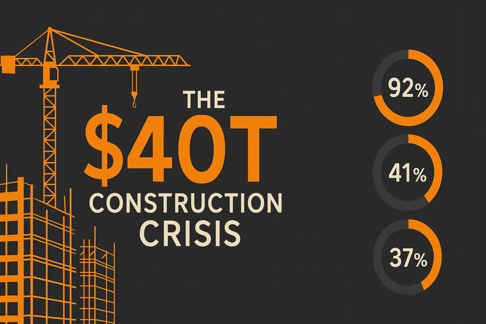
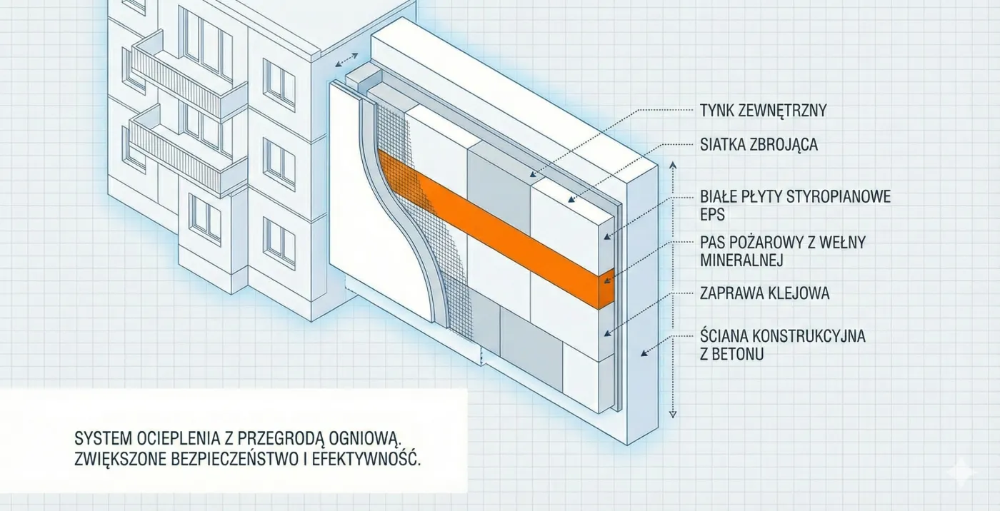
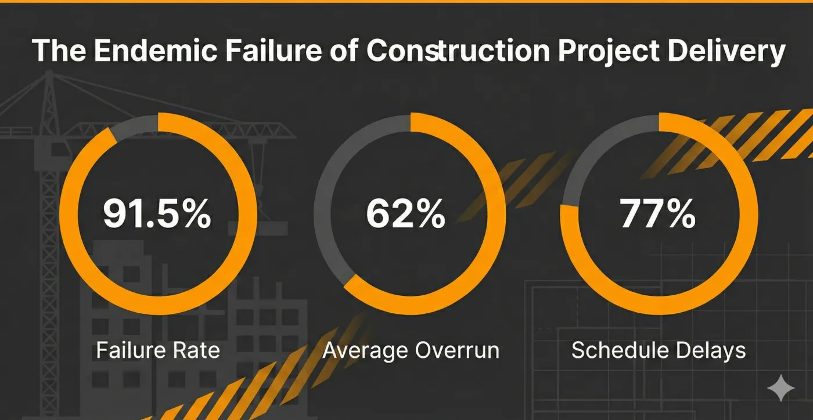
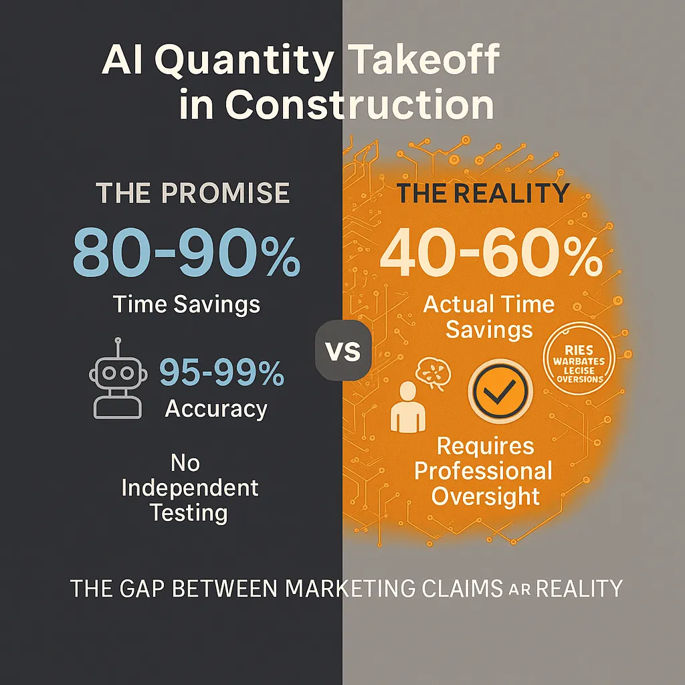
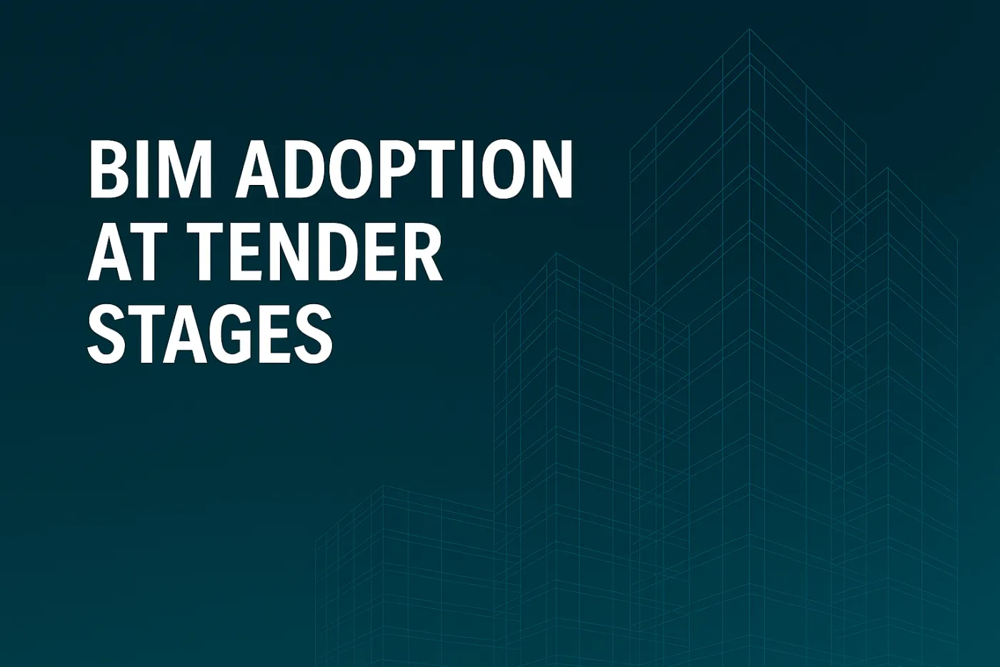

::: {.hero-section}

  <video autoplay muted loop playsinline poster="../../../images/header-background.jpg" preload="none">
    <source data-src="../../../images/hero-video.webm" type="video/webm">
    <source data-src="../../../images/hero-video.mp4" type="video/mp4">
  </video>

::: {.container}
::: {.hero-title}
# Publikacje
### Eksperckie analizy BIM i technologii budowlanych
:::

::: {.hero-subtitle}
Badania oparte na 20-letnim doświadczeniu na rynkach brytyjskim, australijskim i polskim
:::
:::
:::

::: {.container}

::: {style="margin: 48px 0; text-align: center;"}
## Najnowsze publikacje

Nasze badania i analizy pomagają profesjonalistom branży nawigować cyfrową transformację budownictwa.
:::

::: {.publications-grid style="display: grid; grid-template-columns: repeat(auto-fit, minmax(350px, 1fr)); gap: 32px; margin: 48px 0;"}

::: {.publication-card style="background: white; border-radius: 8px; overflow: hidden; box-shadow: 0 4px 12px rgba(0,0,0,0.1); transition: transform 0.3s ease, box-shadow 0.3s ease;"}
::: {style="position: relative; overflow: hidden; height: 200px;"}
{width=1400 height=934 style="width: 100%; height: 100%; object-fit: cover;"}
:::

::: {style="padding: 24px;"}
::: {style="display: flex; gap: 12px; margin-bottom: 12px; flex-wrap: wrap;"}
Branża Budowlana
Infrastruktura
Transformacja Cyfrowa
:::

### Kryzys budownictwa za 40 bilionów dolarów: Wyzwania przekształcające globalną branżę

::: {style="color: #666; font-size: 14px; margin: 12px 0;"}
14 grudnia 2025 | 25 min czytania
:::

::: {style="margin: 16px 0; color: var(--bim-charcoal); line-height: 1.6;"}
Kompleksowa analiza egzystencjalnych wyzwań branży budowlanej: luka infrastrukturalna 40 bilionów dolarów do 2040 roku, kryzys kadrowy z 41% odchodzącymi na emeryturę do 2031 roku, stagnacja produktywności i pilna potrzeba cyfrowej transformacji.
:::

::: {style="margin: 16px 0; padding: 16px; background: var(--bim-light-gray); border-radius: 6px;"}
**Kluczowe spostrzeżenia:**

- Wydatki budowlane muszą wzrosnąć z 13 do 22 bln USD rocznie do 2040
- 92% amerykańskich firm zgłasza trudności z obsadzeniem stanowisk
- 41% siły roboczej sprzed 2020 przejdzie na emeryturę do 2031
- Środowisko budowane odpowiada za 37% globalnych emisji CO2
:::

[Przeczytaj cały artykuł](kryzys-budownictwa-40-bilionow-dolarow.html){.cta-primary style="display: inline-block; margin-top: 16px;"}
:::
:::

::: {.publication-card style="background: white; border-radius: 8px; overflow: hidden; box-shadow: 0 4px 12px rgba(0,0,0,0.1); transition: transform 0.3s ease, box-shadow 0.3s ease;"}
::: {style="position: relative; overflow: hidden; height: 200px;"}
{width=1400 height=716 style="width: 100%; height: 100%; object-fit: cover;"}
:::

::: {style="padding: 24px;"}
::: {style="display: flex; gap: 12px; margin-bottom: 12px; flex-wrap: wrap;"}
Bezpieczeństwo Pożarowe
Przepisy Budowlane
Termomodernizacja
:::

### Styropian na elewacji wielorodzinnego bloku – polskie przepisy kontra brytyjski rygoryzm

::: {style="color: #666; font-size: 14px; margin: 12px 0;"}
📅 29 listopada 2025 | ⏱️ 20 min czytania
:::

::: {style="margin: 16px 0; color: var(--bim-charcoal); line-height: 1.6;"}
Analiza porównawcza przepisów dotyczących stosowania styropianu na elewacjach budynków wielorodzinnych. Polski limit 25 m vs brytyjski zakaz powyżej 18 m – kluczowe różnice regulacyjne i kierunki zmian legislacyjnych od 2026 r.
:::

::: {style="margin: 16px 0; padding: 16px; background: var(--bim-light-gray); border-radius: 6px;"}
**Kluczowe spostrzeżenia:**
- Polska: styropian dozwolony do 25 m; UK: zakaz powyżej 18 m
- Planowane obowiązkowe pasy ogniochronne od września 2026 r.
- Programy dofinansowania: FTiR (do 41%), Ciepłe Mieszkanie (do 60%)
- Transpozycja dyrektywy EPBD do maja 2026 r. zaostrzy przepisy
:::

[Przeczytaj cały artykuł](styropian-na-elewacji-polskie-przepisy-vs-brytyjskie.html){.cta-primary style="display: inline-block; margin-top: 16px;"}
:::
:::

::: {.publication-card style="background: white; border-radius: 8px; overflow: hidden; box-shadow: 0 4px 12px rgba(0,0,0,0.1); transition: transform 0.3s ease, box-shadow 0.3s ease;"}
::: {style="position: relative; overflow: hidden; height: 200px;"}
{width=1400 height=724 style="width: 100%; height: 100%; object-fit: cover;"}
:::

::: {style="padding: 24px;"}
::: {style="display: flex; gap: 12px; margin-bottom: 12px; flex-wrap: wrap;"}
Zarządzanie Projektami
Megaprojekty
Analiza Badawcza
:::

### Endemiczna porażka realizacji projektów budowlanych: dlaczego 91,5% projektów kończy się niepowodzeniem

::: {style="color: #666; font-size: 14px; margin: 12px 0;"}
📅 29 listopada 2025 | ⏱️ 25 min czytania
:::

::: {style="margin: 16px 0; color: var(--bim-charcoal); line-height: 1.6;"}
Analiza badawcza przyczyn systematycznych niepowodzeń projektów budowlanych. Dane Uniwersytetu Oksfordzkiego wskazują, że 91,5% projektów przekracza budżet lub harmonogram, ze średnim przekroczeniem kosztów wynoszącym 62%. Poznaj strukturalne przyczyny stojące za żelaznym prawem megaprojektów.
:::

::: {style="margin: 16px 0; padding: 16px; background: var(--bim-light-gray); border-radius: 6px;"}
**Kluczowe spostrzeżenia:**
- 91,5% projektów przekracza budżet, harmonogram lub jedno i drugie
- Średnie przekroczenie kosztów wynosi 62% — dane z 16 000 projektów
- Wskaźniki przekroczeń pozostają niezmienne od 70 lat pomimo postępu technologicznego
- Optymistyczne nastawienie i strategiczne zniekształcanie jako główne przyczyny
:::

[Przeczytaj cały artykuł](endemiczna-porazka-realizacji-projektow-budowlanych.html){.cta-primary style="display: inline-block; margin-top: 16px;"}
:::
:::

::: {.publication-card style="background: white; border-radius: 8px; overflow: hidden; box-shadow: 0 4px 12px rgba(0,0,0,0.1); transition: transform 0.3s ease, box-shadow 0.3s ease;"}
::: {style="position: relative; overflow: hidden; height: 200px;"}
{width=1024 height=1024 style="width: 100%; height: 100%; object-fit: cover;"}
:::

::: {style="padding: 24px;"}
::: {style="display: flex; gap: 12px; margin-bottom: 12px; flex-wrap: wrap;"}
Technologie Budowlane
AI
Kosztorysowanie
:::

### AI w przedmiarach budowlanych: między deklaracjami marketingowymi a rzeczywistością

::: {style="color: #666; font-size: 14px; margin: 12px 0;"}
📅 23 listopada 2025 | ⏱️ 25 min czytania
:::

::: {style="margin: 16px 0; color: var(--bim-charcoal); line-height: 1.6;"}
Kompleksowa analiza dokładności oprogramowania do przedmiarów budowlanych opartego na AI, ujawniająca przepaść między obietnicami producentów a rzeczywistą wydajnością. Badania pokazują, że deklaracje marketingowe znacząco zawyżają możliwości — rzeczywiste oszczędności czasu to 40-60% zamiast obiecywanych 80-90%, a dokładność 95-99% nie ma niezależnej weryfikacji.
:::

::: {style="margin: 16px 0; padding: 16px; background: var(--bim-light-gray); border-radius: 6px;"}
**Kluczowe spostrzeżenia:**
- Wszystkie deklaracje dokładności pochodzą od producentów — brak niezależnych testów
- RICS wprowadził obowiązkowy nadzór specjalistów nad wynikami AI
- Rzeczywiste oszczędności czasu: 40-60%, nie 80-90% jak deklarują producenci
- Dokładność 97-98% możliwa tylko w idealnych warunkach z czystymi rysunkami wektorowymi
:::

[Przeczytaj cały artykuł](ai-przedmiary-deklaracje-vs-rzeczywistosc.html){.cta-primary style="display: inline-block; margin-top: 16px;"}
:::
:::

::: {.publication-card style="background: white; border-radius: 8px; overflow: hidden; box-shadow: 0 4px 12px rgba(0,0,0,0.1); transition: transform 0.3s ease, box-shadow 0.3s ease;"}
::: {style="position: relative; overflow: hidden; height: 200px;"}
{width=1400 height=934 style="width: 100%; height: 100%; object-fit: cover;"}
:::

::: {style="padding: 24px;"}
::: {style="display: flex; gap: 12px; margin-bottom: 12px; flex-wrap: wrap;"}
Strategia Przetargowa
Kosztorysowanie
BIM
:::

### Mit 70% ceny: Co naprawdę wygrywa przetargi budowlane

::: {style="color: #666; font-size: 14px; margin: 12px 0;"}
📅 22 listopada 2025 | ⏱️ 20 min czytania
:::

::: {style="margin: 16px 0; color: var(--bim-charcoal); line-height: 1.6;"}
Analiza oparta na danych obalająca mit „70% ceny" w zamówieniach budowlanych. Badania pokazują, że 40-50% oceny to kryteria pozacenowe, gdzie dokładne kosztorysowanie i wizualizacja BIM zapewniają mierzalną poprawę współczynnika wygranych o 5-25%.
:::

::: {style="margin: 16px 0; padding: 16px; background: var(--bim-light-gray); border-radius: 6px;"}
**Kluczowe spostrzeżenia:**
- Polska prawnie ogranicza cenę do 60%, brytyjskie najlepsze praktyki stosują 40% ceny
- Dokładność kosztorysowania to czynnik nr 1 — poprawia współczynnik wygranych z 20% do 35-50%
- Strategia BIM dodaje 5-9% do prawdopodobieństwa wygranej
- Zwycięzcy inwestują 25% więcej w przygotowanie oferty niż przegrani
:::

[Przeczytaj cały artykuł](strategie-wygrywania-przetargow.html){.cta-primary style="display: inline-block; margin-top: 16px;"}
:::
:::

::: {.publication-card style="background: white; border-radius: 8px; overflow: hidden; box-shadow: 0 4px 12px rgba(0,0,0,0.1); transition: transform 0.3s ease, box-shadow 0.3s ease;"}
::: {style="position: relative; overflow: hidden; height: 200px;"}
{width=1024 height=1024 style="width: 100%; height: 100%; object-fit: cover;"}
:::

::: {style="padding: 24px;"}
::: {style="display: flex; gap: 12px; margin-bottom: 12px; flex-wrap: wrap;"}
AI & Automatyzacja
Kosztorysowanie
Przyszłość Pracy
:::

### Czy AI zastąpi kosztorysantów? Rzeczywistość cyfrowej rewolucji w budownictwie

::: {style="color: #666; font-size: 14px; margin: 12px 0;"}
📅 16 listopada 2025 | ⏱️ 15 min czytania
:::

::: {style="margin: 16px 0; color: var(--bim-charcoal); line-height: 1.6;"}
Analiza wpływu AI na zawód kosztorysanta oparta na danych. Badania pokazują, że AI przekształci, ale nie zastąpi profesji - ale wykonawcy stoją przed pytaniem o 2,1 mln PLN dotyczącym automatyzacji.
:::

::: {style="margin: 16px 0; padding: 16px; background: var(--bim-light-gray); border-radius: 6px;"}
**Kluczowe spostrzeżenia:**
- 2,1 mln PLN rocznych wydatków na analizę przetargową zagrożonych automatyzacją
- 70% firm budowlanych ma problem ze znalezieniem pracowników z kompetencjami AI
- 44% czasu pracy kosztorysantów może być uwolnione na zadania wyższego rzędu
- Sześć krytycznych barier spowalniających adopcję AI w budownictwie
:::

[Przeczytaj cały artykuł](ai-czy-zastapi-kosztorysantow.html){.cta-primary style="display: inline-block; margin-top: 16px;"}
:::
:::

::: {.publication-card style="background: white; border-radius: 8px; overflow: hidden; box-shadow: 0 4px 12px rgba(0,0,0,0.1); transition: transform 0.3s ease, box-shadow 0.3s ease;"}
::: {style="position: relative; overflow: hidden; height: 200px;"}
{width=1400 height=934 style="width: 100%; height: 100%; object-fit: cover;"}
:::

::: {style="padding: 24px;"}
::: {style="display: flex; gap: 12px; margin-bottom: 12px; flex-wrap: wrap;"}
Adopcja BIM
Rynek Polski
Porównanie UK
:::

### Adopcja BIM na etapie przetargów: Dlaczego wykonawcy stawiają opór i czego Polska może nauczyć się od Wielkiej Brytanii

::: {style="color: #666; font-size: 14px; margin: 12px 0;"}
📅 5 października 2025 | ⏱️ 20 min czytania
:::

::: {style="margin: 16px 0; color: var(--bim-charcoal); line-height: 1.6;"}
Dogłębna analiza barier adopcji BIM podczas przetargów, porównanie sukcesu Wielkiej Brytanii (73% adopcji) z wyzwaniami Polski (8,9% adopcji wśród wykonawców). Kompleksowe zbadanie barier ekonomicznych, technicznych, organizacyjnych i prawnych, z praktycznymi rekomendacjami politycznymi dla mandatu Polski 2030.
:::

::: {style="margin: 16px 0; padding: 16px; background: var(--bim-light-gray); border-radius: 6px;"}
**Kluczowe spostrzeżenia:**
- Luka 64,1 punktu procentowego w adopcji między wykonawcami brytyjskimi i polskimi
- 128 400-705 000 USD rocznych nieodzyskanych kosztów BIM dla aktywnych oferentów
- Tylko 33% projektów w UK udostępnia BIM na etapie przetargu pomimo mandatu
- Sześć priorytetowych obszarów działania dla transformacji Polski
:::

[Przeczytaj cały artykuł](adopcja-bim-na-etapie-przetargow.html){.cta-primary style="display: inline-block; margin-top: 16px;"}
:::
:::

:::

::: {style="margin: 64px 0; padding: 48px 32px; background: linear-gradient(135deg, var(--bim-charcoal) 0%, #3a3a3a 100%); border-radius: 8px; text-align: center;"}
::: {style="max-width: 800px; margin: 0 auto;"}
<h2 style="color: var(--bim-white); border-bottom: 3px solid var(--bim-orange); padding-bottom: 16px; margin-bottom: 24px;">Bądź na bieżąco z technologiami budowlanymi</h2>

Subskrybuj, aby otrzymywać nasze najnowsze badania, analizy branżowe i praktyczne przewodniki wdrożeniowe.

::: {style="display: flex; gap: 16px; justify-content: center; flex-wrap: wrap;"}
[Skontaktuj się z nami](../../kontakt.html){.cta-primary}
[Zobacz nasze usługi](../../uslugi/kosztorysowanie-i-planowanie-budzetu.html){.cta-secondary}
:::

::: {style="margin-top: 32px; padding-top: 32px; border-top: 1px solid rgba(255, 255, 255, 0.2);"}

<i class="bi bi-patch-check-fill" style="color: var(--bim-orange);" aria-hidden="true"></i> <strong>Analizy oparte na badaniach</strong>

<i class="bi bi-patch-check-fill" style="color: var(--bim-orange);" aria-hidden="true"></i> <strong>20 lat doświadczenia międzynarodowego</strong>

<i class="bi bi-patch-check-fill" style="color: var(--bim-orange);" aria-hidden="true"></i> <strong>Rynki brytyjski, australijski i polski</strong>

:::
:::
:::

::: {style="margin: 48px 0;"}
## O naszych publikacjach

Publikacje BIM Takeoff czerpią z 20-letniego międzynarodowego doświadczenia w świadczeniu usług kosztorysowania BIM 5D na rynkach brytyjskim, australijskim i polskim. Nasze badania łączą:

::: {style="display: grid; grid-template-columns: repeat(auto-fit, minmax(250px, 1fr)); gap: 24px; margin: 32px 0;"}
::: {style="padding: 24px; background: var(--bim-light-gray); border-radius: 8px; border-left: 4px solid var(--bim-orange);"}
### <i class="bi bi-graph-up-arrow" style="color: var(--bim-orange);" aria-hidden="true"></i> Analiza rynku

Rzeczywiste dane z 2000+ projektów na wielu rynkach, śledzenie trendów adopcji, barier i czynników sukcesu.
:::

::: {style="padding: 24px; background: var(--bim-light-gray); border-radius: 8px; border-left: 4px solid var(--bim-orange);"}
### <i class="bi bi-globe" style="color: var(--bim-orange);" aria-hidden="true"></i> Perspektywa międzynarodowa

Analiza porównawcza rynków budowlanych w UK, Australii i Polsce z lekcjami wyniesionymi z każdego z nich.
:::

::: {style="padding: 24px; background: var(--bim-light-gray); border-radius: 8px; border-left: 4px solid var(--bim-orange);"}
### <i class="bi bi-tools" style="color: var(--bim-orange);" aria-hidden="true"></i> Praktyczne wdrożenie

Praktyczne rekomendacje oparte na doświadczeniu praktycznym, a nie tylko analizie teoretycznej.
:::
:::
:::

::: {style="margin: 48px 0; padding: 32px; background: var(--bim-light-gray); border-radius: 8px;"}
## Tematy, które poruszamy

Nasze publikacje odnoszą się do najbardziej krytycznych wyzwań stojących przed branżą budowlaną:

::: {style="display: grid; grid-template-columns: repeat(auto-fit, minmax(200px, 1fr)); gap: 16px; margin: 24px 0;"}
- **Adopcja i wdrażanie BIM**
- **Zarządzanie przetargami**
- **Technologie kosztorysowania**
- **Zgodność regulacyjna**
- **Transformacja cyfrowa**
- **Analiza rynku**
- **Rekomendacje polityczne**
- **ROI i analiza biznesowa**
:::
:::

::: {style="margin: 48px 0; text-align: center;"}
### Masz pytanie badawcze?

Zapraszamy do współpracy przy badaniach i analizach branżowych.

[Skontaktuj się z nami](../../kontakt.html){.cta-secondary style="display: inline-block;"}
:::

:::

